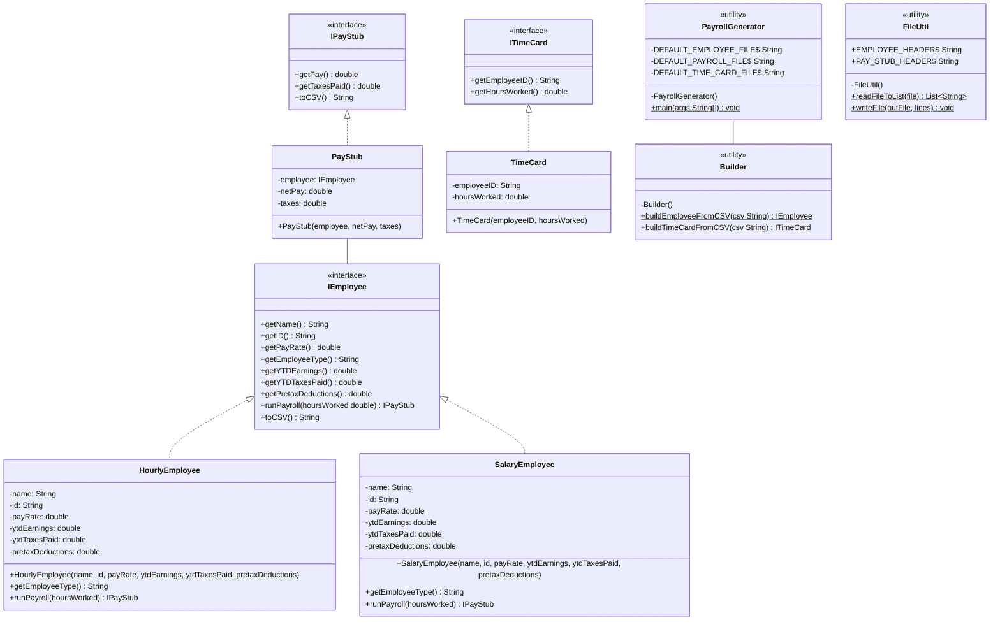
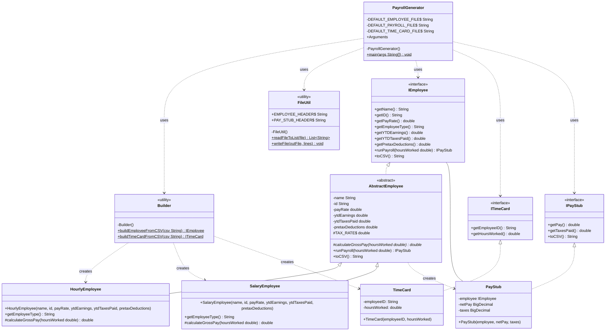

# Payroll Generator Design Document

This document is meant to provide a tool for you to demonstrate the design process. You need to work on this before you code, and after have a finished product. That way you can compare the changes, and changes in design are normal as you work through a project. It is contrary to popular belief, but we are not perfect our first attempt. We need to iterate on our designs to make them better. This document is a tool to help you do that.

## (INITIAL DESIGN): Class Diagram

Place your class diagram below. Make sure you check the fil in the browser on github.com to make sure it is rendering correctly. If it is not, you will need to fix it. As a reminder, here is a link to tools that can help you create a class diagram: [Class Resources: Class Design Tools](https://github.com/CS5004-khoury-lionelle/Resources?tab=readme-ov-file#uml-design-tools)

 
## (INITIAL DESIGN): Tests to Write - Brainstorm

Write a test (in english) that you can picture for the class diagram you have created. This is the brainstorming stage in the TDD process. 

> [!TIP]
> As a reminder, this is the TDD process we are following:
> 1. Figure out a number of tests by brainstorming (this step)
> 2. Write **one** test
> 3. Write **just enough** code to make that test pass
> 4. Refactor/update  as you go along
> 5. Repeat steps 2-4 until you have all the tests passing/fully built program

You should feel free to number your brainstorm. 

1. Test that the `Employee` class properly returns `name` from `getName()`
2. Test that the `Employee` class properly returns `id` from `getId()`
3. continue to add your brainstorm here (you don't need to super formal - this is a brainstorm) - yes, you can change the bullets above to something that fits your design.

***
1. Test that the `TimeCard` constructor properly initializes all required fields
2. Test that the `TimeCard` class properly returns `employeeID` from `getEmployeeID()`
3. Test that the `TimeCard` class properly returns `hoursWorked` from `getHoursWorked()`
4. Test that the `TimeCard` properly works with invalid input values
5. Test that the `PayStub` class properly returns `netPay` from `getPay()`
6. Test that the `PayStub` class properly returns `taxes` from `getTaxesPaid()`
7. Test that the `PayStub` properly formats CSV string from `toCSV()`
8. Test that the `PayStub` properly works with invalid input values 
9. Test that the `HourlyEmployee` constructor properly initializes all required fields 
10. Test that the `HourlyEmployee` class properly returns expected values from getter methods 
11. Test that the `HourlyEmployee` constructor properly works with invalid input values 
12. Test that `runPayroll()` method of `HourlyEmployee` calculates pay correctly for normal hours (<=40)
13. Test that `runPayroll()` method of `HourlyEmployee` calculates pay correctly for overtime hours (>40)
14. Test that `runPayroll()` method of `HourlyEmployee` correctly updates YTD values after running payroll 
15. Test that `toCSV()` method of `HourlyEmployee` generates the correct CSV string format
16. Test that the `SalaryEmployee` constructor properly initializes all required fields 
17. Test that the `SalaryEmployee` class properly returns expected values from getter methods 
18. Test that the `SalaryEmployee` constructor properly handles invalid input values 
19. Test that `runPayroll()` method of `SalaryEmployee` calculates pay correctly 
20. Test that `runPayroll()` method of `SalaryEmployee` correctly updates YTD values after running payroll 
21. Test that `toCSV()` method of `SalaryEmployee`generates the correct CSV string format
22. Test that the `Builder` correctly builds an HourlyEmployee from CSV 
23. Test that the `Builder` correctly builds a SalaryEmployee from CSV 
24. Test that the `Builder` throws an exception for invalid Employee CSV input 
25. Test that the `Builder` correctly builds a TimeCard from CSV 
26. Test that the `Builder` throws an exception for invalid TimeCard CSV input

## (FINAL DESIGN): Class Diagram

Go through your completed code, and update your class diagram to reflect the final design. Make sure you check the file in the browser on github.com to make sure it is rendering correctly. It is normal that the two diagrams don't match! Rarely (though possible) is your initial design perfect. 

> [!WARNING]
> If you resubmit your assignment for manual grading, this is a section that often needs updating. You should double check with every resubmit to make sure it is up to date.

## (FINAL DESIGN): Reflection/Retrospective

> [!IMPORTANT]
> The value of reflective writing has been highly researched and documented within computer science, from learning new information to showing higher salaries in the workplace. For this next part, we encourage you to take time, and truly focus on your retrospective.

Take time to reflect on how your design has changed. Write in *prose* (i.e. do not bullet point your answers - it matters in how our brain processes the information). Make sure to include what were some major changes, and why you made them. What did you learn from this process? What would you do differently next time? What was the most challenging part of this process? For most students, it will be a paragraph or two. 

When I first designed the UML, I basically created separate implementations for HourlyEmployee and SalaryEmployee that looked almost identical. But as I worked on my code, I realized that these two classes could use an abstract base class, AbstractEmployee, to capture all shared properties and behaviors. By introducing this abstract class, I could define common methods like runPayroll() and toCSV(), while still allowing each employee type to have its own unique way of calculating the gross payroll through the abstract calculateGrossPay() method.

As I completed this program, I thought more deeply about the relationships between each class, and added more explicit dependency arrows to show how PayrollGenerator interacts with utility classes like Builder and FileUtil, making the architecture of the system clearer.

I also increased the precision of financial calculations by switching monetary values from double to BigDecimal. Seeing the professor's response on Piazza, I realized that we can use BigDecimal in internal operations to provide high-precision calculations and avoid the accumulation of errors, and convert BigDecimal to double on output and round to two decimal places.

This process taught me that software design is never truly finished - it is a process of continuous refinement and improvement.